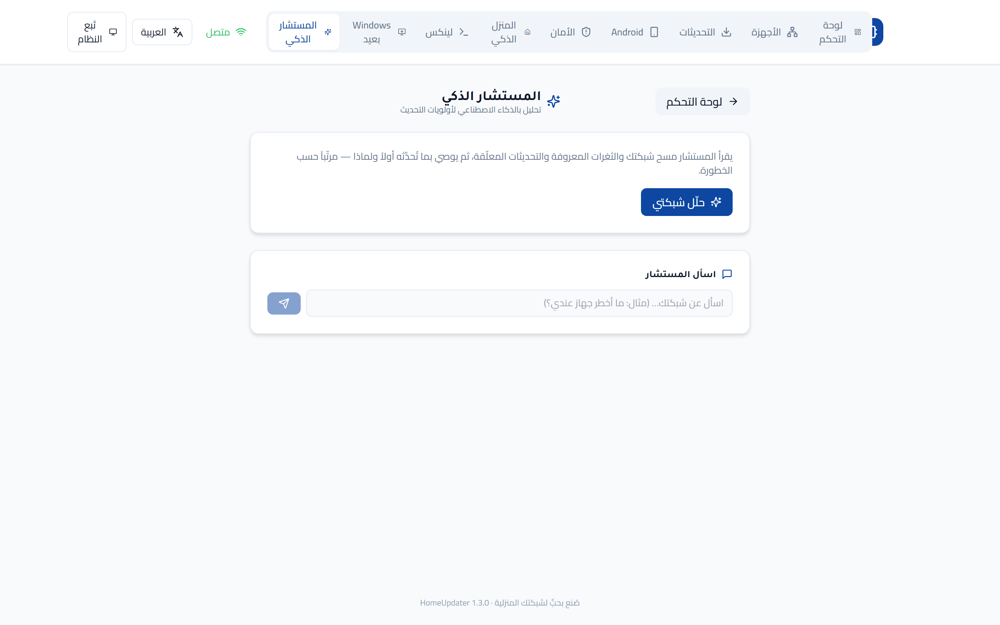
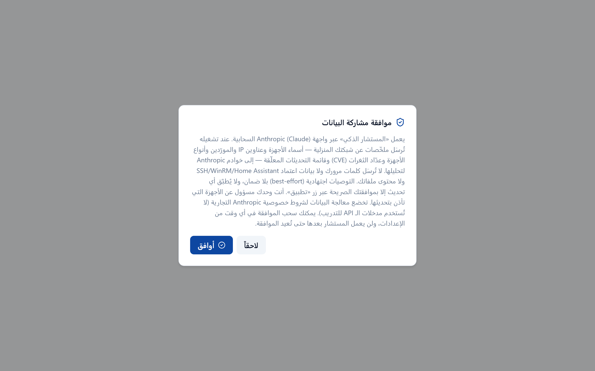
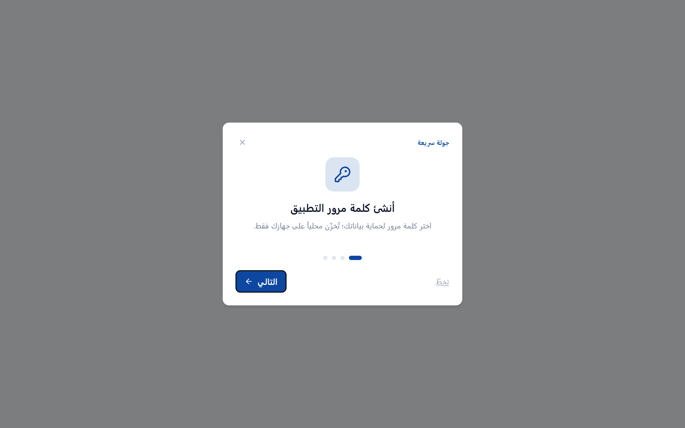
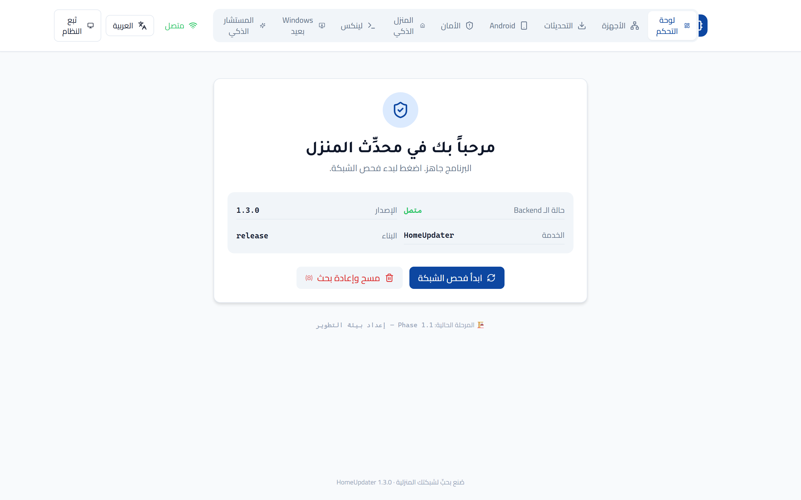
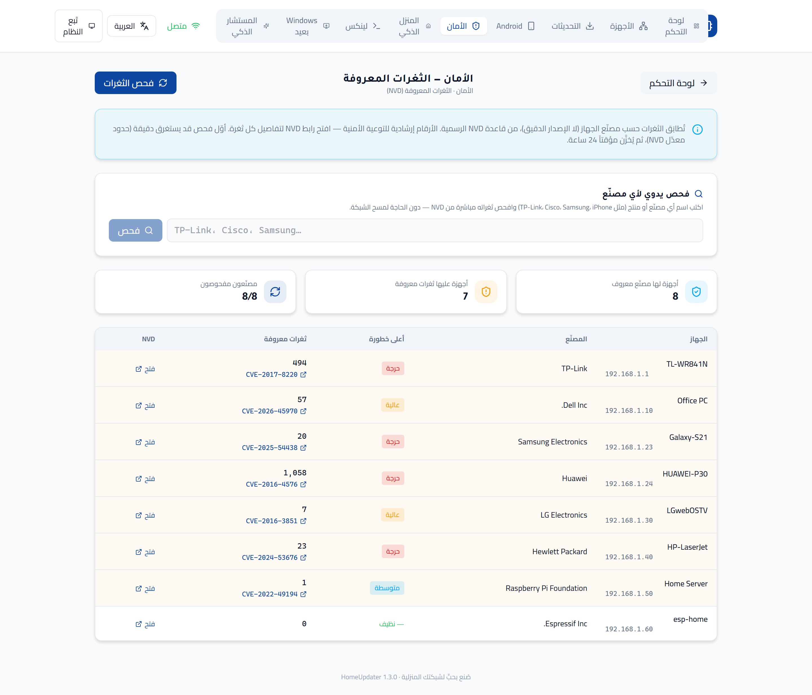
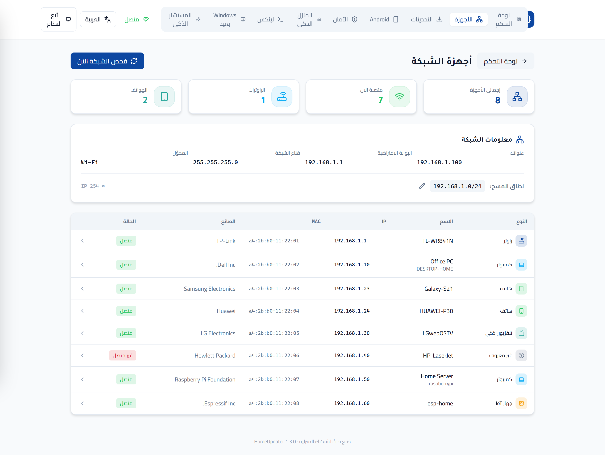
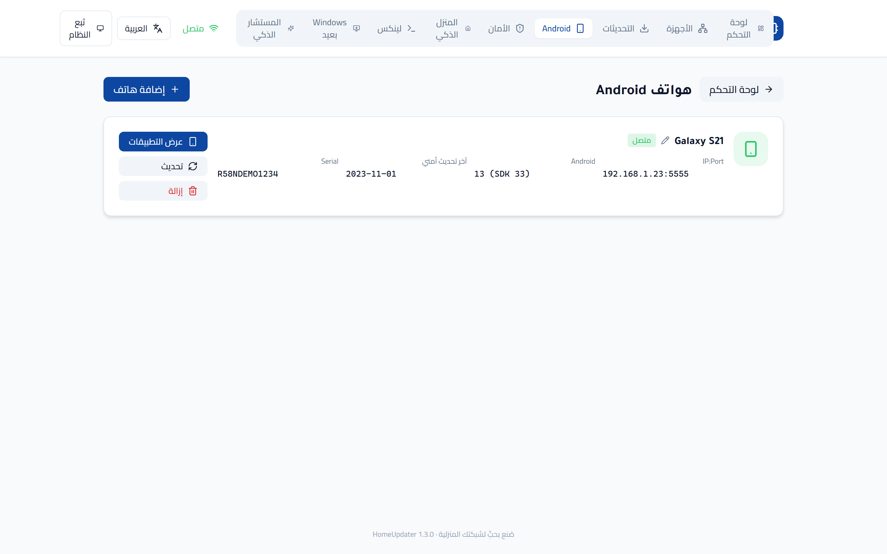
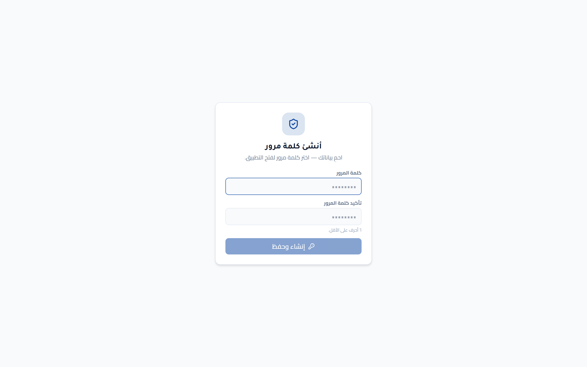

# 🏠 محدِّث المنزل · HomeUpdater

**حدِّث كل أجهزة شبكتك المنزلية من مكان واحد — بذكاء اصطناعي، وبإذنك.**

**Update every device on your home network from one place — with AI, and with your permission.**

-success)

[**⬇️ تنزيل آخر إصدار / Download the latest installer**](https://github.com/mohanad98765/HomeUpdater/releases/latest)

[**▶️ شاهد العرض التوضيحي · Watch the demo**](screenshots/HomeUpdater-demo.mp4)

 

🏅 معتمَد من برنامج كنز للذكاء الاصطناعي · Certified by the Kanz AI Program — `KANZ-ADV-4015`

---

## ما هو؟ · What is it?

**HomeUpdater** تطبيق ويندوز **محلي** يكتشف أجهزة شبكتك المنزلية (ويندوز، Android، لينكس، أجهزة المنزل الذكي) ويُدير تحديثاتها **من واجهة واحدة** — دون سحابة، وبكامل تحكّمك.

A **local** Windows app that discovers the devices on your home network — Windows PCs, Android phones, Linux hosts, and smart‑home devices — and manages their updates from **one dashboard**. No cloud, full user control.

## 🤖 القلب: المستشار الذكي (Agentic AI)

المميّز في المشروع مستشار يعمل بأسلوب **agentic tool‑use** عبر Claude: يقرأ مسح الشبكة والثغرات المعروفة (NVD) والتحديثات المعلّقة عبر أدوات محلية، ثم **يوصي، ويحاور، ويُطبّق التحديثات — بإذنك**، محلياً وعن بُعد.

The centerpiece is an **agentic AI advisor** (Claude, tool‑use loop): it reads the network scan, known vulnerabilities (NVD), and pending updates through local tools, then **recommends, chats, and applies updates — with your permission**, both locally and on remote hosts.

## المزايا · Features

| | |
|---|---|
| 🖥️ **Windows** | تحديثات محلية (winget + Windows Update) وعن بُعد (WinRM) |
| 📱 **Android** | ربط لاسلكي مع **إقران Android 11+** واكتشاف المنفذ تلقائياً (mDNS) |
| 🐧 **Linux** | تحديثات عبر SSH (apt / dnf) مع تحقّق هوية المضيف (TOFU) |
| 🏠 **Smart Home** | تكامل Home Assistant |
| 🛡️ **الأمان** | ثغرات NVD لكل جهاز مع رابط CVE مباشر · تقرير PDF |
| 🔒 **قفل بكلمة مرور** | حماية بيانات التطبيق (PBKDF2 hashed، بلا افتراضي) |
| 🌐 **٦ لغات** | واجهة عربية أصيلة (RTL) + EN/FR/ES/TR/UR |

## لقطات · Screenshots

| 🤖 المستشار الذكي · AI Advisor | 🔐 موافقة مشاركة البيانات · Data-sharing consent |
|:---:|:---:|
|  |  |
| **👋 الجولة الترحيبية · Onboarding tour** | **🖥️ لوحة التحكم · Dashboard** |
|  |  |
| **🛡️ الأمان (CVE) · Security** | **🌐 الأجهزة · Devices** |
|  |  |
| **📱 ربط Android لاسلكياً · Android pairing** | **🔒 قفل الدخول · Login lock** |
|  |  |

## التنزيل والتشغيل · Install

1. نزّل `HomeUpdater-Setup-x.y.z.exe` من [صفحة الإصدارات](https://github.com/mohanad98765/HomeUpdater/releases/latest).
2. شغّله (يتطلّب صلاحيات مسؤول — UAC). أوّل تشغيل يطلب إنشاء كلمة مرور.
3. المستشار الذكي يحتاج مفتاح Anthropic API (يُدخَل داخل التطبيق ويُخزَّن مُشفَّراً على جهازك).

> المثبِّت **موقَّع رقمياً** (SHA‑256 + طابع زمني RFC‑3161). التوقيع self‑signed حالياً، لذا قد يُظهر SmartScreen تحذيراً على أجهزة أخرى — «More info → Run anyway».

## الأمان · Security

تشفير الاعتمادات عند التخزين (Fernet + DPAPI) · قفل التطبيق بكلمة مرور مُجزّأة · مصادقة الـ API المحلي (توكن جلسة + CSRF + حماية DNS‑rebinding) · تحقّق هوية المضيف (SSH TOFU + WinRM TLS) · توقيع الكود · فحص ثغرات NVD.

## التقنيات · Tech stack

**Backend:** Python · FastAPI · SQLAlchemy (async) · Alembic · pywinrm · asyncssh · Anthropic SDK
**Frontend:** React · TypeScript · Vite · Tailwind (RTL)
**Desktop:** PyInstaller · WebView2 (نافذة أصلية) · Inno Setup

---

صُنع بحبٍّ لشبكتك المنزلية · Built with care for your home network

